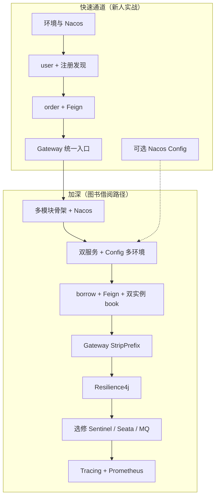

# Spring Cloud 学习路径（合并预览）

> 汇总自：`~/.cursor/plans/spring_cloud_nacos_学习路径_*.plan.md` 与 `spring_cloud_新人实战_*.plan.md`  
> 在 Cursor 中打开本文件后，可用 **Markdown 预览**（Ctrl+Shift+V）或分屏查看。

---

## 两条计划怎么选

| 文档主线 | 业务场景 | 强度 | 适合 |
|----------|----------|------|------|
| Nacos 详细路径 | 图书借阅（user / book / borrow / gateway） | 高：接口约定、验收、踩坑 | 系统学完注册/配置/调用/网关/容错/观测 |
| 新人实战 | 用户 + 订单 + 网关 | 中：周节奏清晰 | 快速上手，与 Boot 4 + Java 17 工程对齐 |

**建议**：先按「新人实战」跑通 Nacos + Feign + Gateway，再切「图书借阅」补 Config、双实例、幂等与 Resilience4j。

---

## 与当前仓库（cloudTest）

- 父工程宜改为 **Maven 多模块** 或独立多工程。
- **Spring Boot 4** 须与 **Spring Cloud / spring-cloud-alibaba** 官方兼容表对齐 BOM，勿混用过期博客组合。
- Gateway 与阻塞式 `spring-boot-starter-web` 的依赖组合以当前官方文档为准。

---

## 总路线图



---

## 阶段对照（合一验收）

| 阶段 | 新人实战 | 图书路径 | 完成标志 |
|------|----------|----------|----------|
| 环境 | Docker Nacos | 父 POM、BOM、`mvn install` | 控制台可登录 + 至少一子模块可运行 |
| 注册 | user-service | user + book | 控制台见服务名 / 实例 / 健康 |
| 调用 | order → user | borrow → user/book，双实例 book | 按服务名调用 + 观察到多实例 |
| 网关 | `/api/order/**`、`/api/user/**` | `/api/*` 三路 + StripPrefix | 只暴露网关，无双重 `/api` |
| 配置 | 可选刷新 | Namespace + DataId | 改 Nacos 后行为可见变化 |
| 容错 | 第 5～6 周选一条 | 超时 / 熔断 / 降级 + 演练 | 下游故障可降级，Actuator 可看熔断 |
| 进阶 | Sentinel / Seata | M5 三选一 + M6 | 限流或事务或消息 **或** 全链路 Trace |

---

## 时间参考

| 范围 | 日历（约） |
|------|------------|
| 仅快速通道 M1～M3 | 3～4 周，每周 6～10 h |
| + 图书 M2～M4（含熔断） | 再加 3～5 周 |
| 含 M5 选修 + M6 | 与原详细版合计约 4～8 周（不含 M5 则略短） |

---

## 图书借阅最小接口（详细路径原文摘要）

**user-service（例 8081）**

- `POST /users`：`loginName`, `displayName`
- `GET /users/{id}`：404 若不存在

**book-service（例 8082）**

- `POST /books`：`title`, `totalStock`
- `GET /books/{id}`
- `POST /books/{id}/borrow`：扣库存；建议 `X-Idempotency-Key` 幂等

**borrow-service（例 8083）**

- `POST /borrows`：`userId`, `bookId`（可选 `clientRequestId`）
- `GET /borrows/{id}`

**gateway（例 8080）**

- `/api/user/**` → user-service  
- `/api/book/**` → book-service  
- `/api/borrow/**` → borrow-service  

注意 M3 配置 `StripPrefix`，避免下游路径重复。

---

## 多模块结构（建议）

```text
library-cloud/
├── pom.xml
├── gateway-service/
├── user-service/
├── book-service/
├── borrow-service/
└── (可选) common-lib/
```

---

## 补充：原计划在外的建议

1. **前置 1 天**：Maven 多模块、`dependencyManagement`、REST、Docker、Postman/curl。  
2. **安全**：配置中心敏感项用环境变量或密钥管理；网关预留鉴权扩展点。  
3. **测试**：每里程碑保留 1 个最小自动化（如 `MockMvc` 或固定请求/响应样例）。  
4. **学习习惯**：每步 5 行笔记——改了什么配置、Nacos 里看到什么、哪条请求证明成功。  
5. **故障演练**：错服务名、错 namespace、随机停实例。

---

## 官方参考（版本以页面为准）

- [Spring Cloud](https://spring.io/projects/spring-cloud)  
- [Spring Cloud Alibaba 版本说明](https://github.com/alibaba/spring-cloud-alibaba/wiki/%E7%89%88%E6%9C%AC%E8%AF%B4%E6%98%8E)  
- [Nacos 文档](https://nacos.io/zh-cn/docs/quick-start.html)  

---

## 源计划文件路径（本机）

- `C:\Users\admin\.cursor\plans\spring_cloud_nacos_学习路径_5fd80964.plan.md`  
- `C:\Users\admin\.cursor\plans\spring_cloud_新人实战_61dc6e47.plan.md`  
